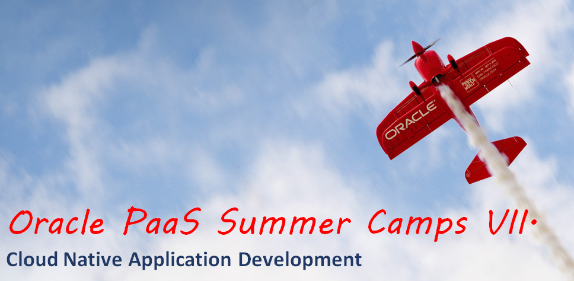

## Prerequisites

#### Virtualbox VM images

This workshop requires the [cando.v2.0.ova](https://drive.google.com/open?id=0B0MXC4qaECO6RHBWMEttdW9fOVk) virtualbox image to be downloaded and imported.

#### Oracle Public Cloud PaaS  account

The workshop is intended to work with an Oracle PaaS trial account. Get the following account details ready to complete the tutorial and replace to your values when it is required:

+ Oracle Cloud account **username** and **password**
+ Oracle Cloud **identity domain**
+ **Data center/region**

----

| **Wednesday** |  |
|-------------|----------------------------------------------------------------------------------------------------------------------------------------------------------------------------|
| 9:00-9:30 | Introduction to workshop |
| 9:30-10:30 |  Oracle Java Cloud Service |
| **10:30-10:45** | **Coffee break** |
| 10:45-12:00 |  Oracle Application Container Cloud Service |
| 12:00-13:00 | Oracle Developer Cloud Service |
| **13:00-14:00** | **Lunch** |
| 13:00-15:15 | [Lab 1: Agile Project Management](microservices/CloudNative100.md) |
| **15:15-15:30** | **Coffee break** |
| 15:30-17:00 | [Lab 2: Continuous Delivery of Java Microservices](microservices/CloudNative200.md) |

| **Thursday** |  |
|-------------|----------------------------------------------------------------------------------------------------------------------------------------------------------------------------|
| 9:00-10:30 | [Lab 3: Cloud Native Rapid JavaScript Development with Node.js](microservices/CloudNative300.md) |
| **10:30-10:45** | **Coffee break** |
| 10:45-11:30 | [Lab 4: Cloud Native Developer Cloud Service Administration](microservices/CloudNative400.md) |
| 11:30-13:00 | [Lab 5: Migrate Weblogic 10.3.6 (on premise) Application to Java Cloud Service with App2Cloud tool](app-2-cloud/README.md) |
| **13:00-14:00** | **Lunch** |
| 14:00-14:30 | [Lab 6: Scaling Down Nodes in a Java Cloud Service Instance Using the Command Line Interface](jcs-scale-down-psm/README.md) |
| 14:30-15:15 | [Lab 7: Deploy Tomcat based application to Application Container Cloud Service](accs-tomcat/README.md) |
| **15:15-15:30** | **Coffee break** |
| 15:30-16:30 | [Lab 8: FixItFast Cloud Native Application which includes multiple Oracle Application Container Cloud Services (Cache, Java, NodeJS)](stack/stack.cache.md) |

| **Friday** |  |
|-------------|----------------------------------------------------------------------------------------------------------------------------------------------------------------------------|
| 9:00-9:45 | Docker Native Application Development |
| 9:45-10:30 | [Lab 9: Build Node.js-MongoDB container packaged application using Wercker and deploy to Oracle Container Cloud Service as the Stack of services](nodejs-mongodb-stack/README.md) |
| **10:30-10:45** | **Coffee break** |
| 10:45-11:30 | [Lab 9: Build Node.js-MongoDB container packaged application using Wercker and deploy to Oracle Container Cloud Service as the Stack of services](nodejs-mongodb-stack/README.md) |
| 11:30-13:00 | [Lab 10: Deploy SpringBoot demo application to Application Container Cloud Services using Developer Cloud Services](springboot-sample/README.md) |
| **13:00-14:00** | **Lunch** |
| 14:00-15:15 | [Lab 11: Deploying APM Agent and setting up Application Performance Monitoring](apm/README.md) |
| **15:15-15:30** | **Coffee break** |

---

### Contributing

Pull Requests are currently not being accepted. 

### [License](LICENSE.md)
