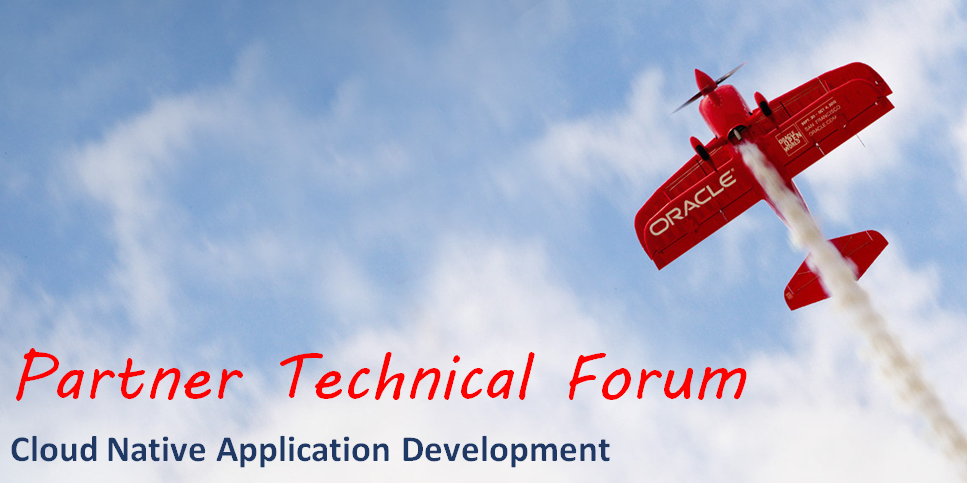

## Prerequisites

#### Virtualbox VM images

This workshop requires the [DevOpsWorkshopV3_final_JavaOne.ova](https://drive.google.com/open?id=0B0MXC4qaECO6RHBWMEttdW9fOVk) virtualbox image to be downloaded and imported.

#### Oracle Public Cloud PaaS  account

The workshop is intended to work with an Oracle PaaS trial account. Get the following account details ready to complete the tutorial and replace to your values when it is required:

+ Oracle Cloud account **username** and **password**
+ Oracle Cloud **identity domain**
+ **Data center/region**

----

#### DevOps and Cloud Native Microservices

+ [Lab 1: Agile Project Management](microservices/CloudNative100.md)
+ [Lab 2: Continuous Delivery of Java Microservices](microservices/CloudNative200.md)
+ [Lab 3: Cloud Native Rapid JavaScript Development with Node.js](microservices/CloudNative300.md)
+ [Lab 4: Cloud Native Developer Cloud Service Administration](microservices/CloudNative400.md)

#### Container based application development lifecycle using Wercker and Container Cloud Service ####

+ [Lab 5: Build Node.js-MongoDB container packaged application using Wercker and deploy to Oracle Container Cloud Service as the Stack of services](nodejs-mongodb-stack/README.md)

#### OPTIONAL: Deploy complex cloud environment using Oracle Cloud Stack Manager ###
+ [Lab 6: FixItFast Cloud Native Application which includes multiple Oracle Application Container Cloud Services (Cache, Java, NodeJS)](stack/stack.cache.md)

---

### Contributing

Pull Requests are currently not being accepted. 

### [License](LICENSE.md)
