# ORACLE Cloud-Native DevOps workshop #
----
## Scaling WLS Nodes in a Java Cloud Service Instance ##

### Introduction ###
Upon deploying applications to JCS, you may need to scale your JCS instance in response to varying workload. You can scale an Oracle Java Cloud Service instance by scaling a cluster, a node, or the Coherence data tier in the service instance.

You can scale out an Oracle Java Cloud Service cluster to add one node to the cluster. When you scale out, Oracle Java Cloud Service creates a new VM running a WebLogic Server Managed Server instance.

You can also scale up or down a node to change the compute shape, memory, or block storage size. For more information about scaling an Oracle Java Cloud Service Instance, see the [documentation](https://docs.oracle.com/cloud/latest/jcs_gs/JSCUG/GUID-02D79DE3-643B-44B9-A979-340BD472B529.htm#JSCUG3289). In this tutorial, you will go through steps to scale up using JCS Console. Please note that it is also possible to perform the same task using PSM CLI (Platform Service Manager Command Line Interface).

### Prerequisites ###

- Running Java Cloud Service with out-of-the-box [sample application](https://docs.oracle.com/en/cloud/paas/java-cloud/jscug/sample-application-deployed-oracle-java-cloud-service-instance.html) deployed
- which has 1 or more nodes that may or may not be fronted by JCS Load Balancer

### Steps ###
Navigate to the Oracle Java Cloud Service Console.[Sign in](../common/sign.in.to.oracle.cloud.md) to [https://cloud.oracle.com/sign-in](https://cloud.oracle.com/sign-in). On the dashboard open the Java Cloud Service Console.

Click the service instance hosting sample application. If you have a JCS service instance with a different application that has been deployed successfully, you can continue the lab with that instance too. The deployed and running application here is used only to validate the scale-up or scale-down operation is successful.

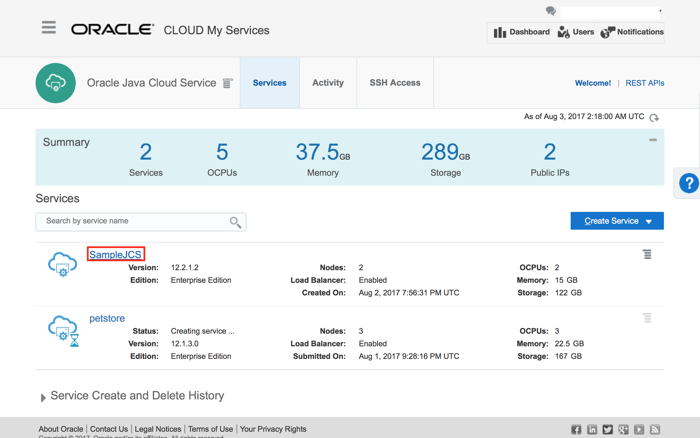

First, check whether the application is up and running by clicking the **Content Endpoint** url, which consists of the public IP address of your load balancer, if one is configured for the service, or the public address of one of the WLS node and root context of the application.

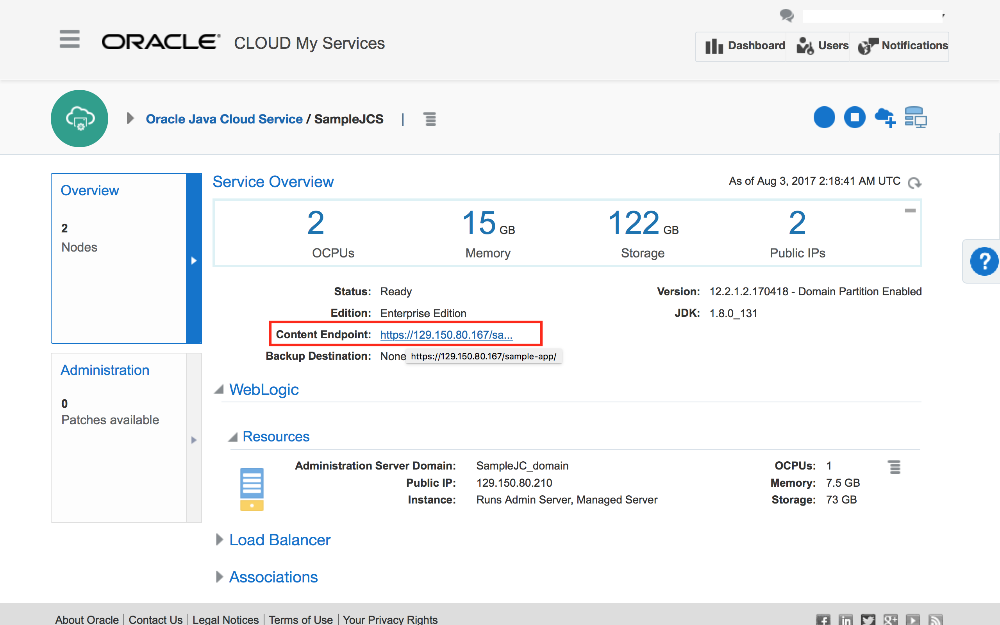
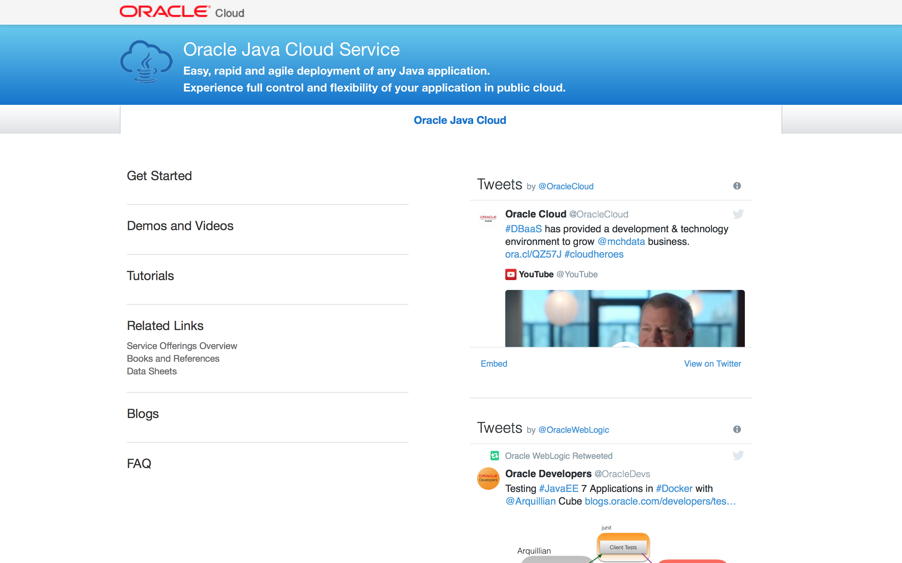

Come back to **JCS Service Instance Detail** page. Take the note of the number of OCPUs of the WLS node that you want to scale up in the **WLS/Resources** section under **Service Overview**. In this particular scenario, the selected node is currently consuming 1 OCPU.

Click the small gray menu icon on its right side, and select **Scale Up/Down** menu item.
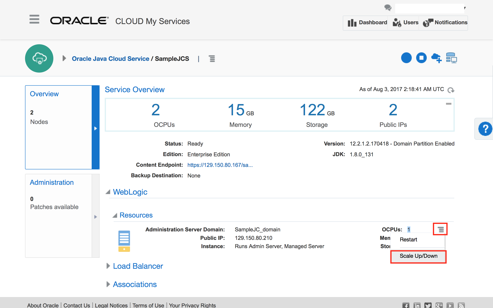

Click the **New Compute Shape** dropdown in the pop-up, and select a compute shape that you want to scale the node up to. In this example, **OC4 - 2 OCPUs, 15GB** is selected. Please do not pick a compute shape which can cause a quota breach in your cloud account. Click **Yes, Scale Up/Down Server**.

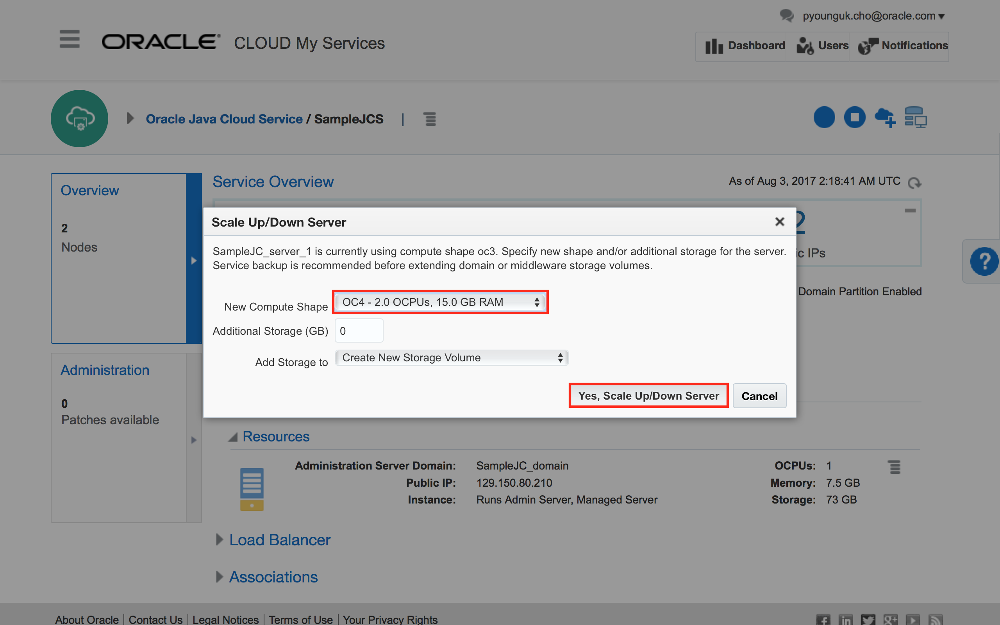

You will see a confirmation message **The scale up/down request is accepted** on the service instance detail page. Click **Oracle Java Cloud Service** link in the breadcrumb menu at the top of the page.

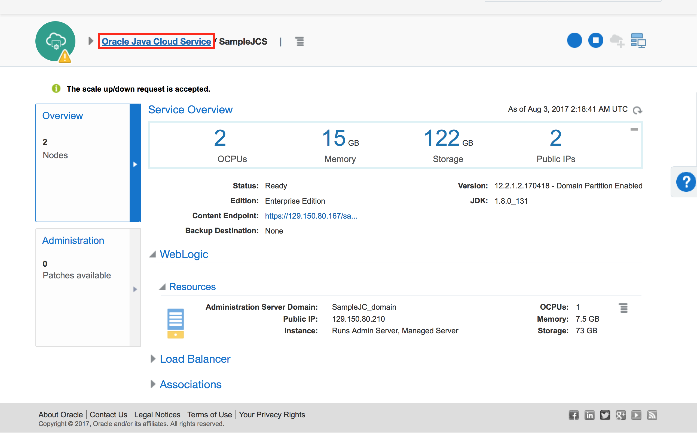

Click **Activity** tab, and you will a new **Scale Up/Down** operation has started.
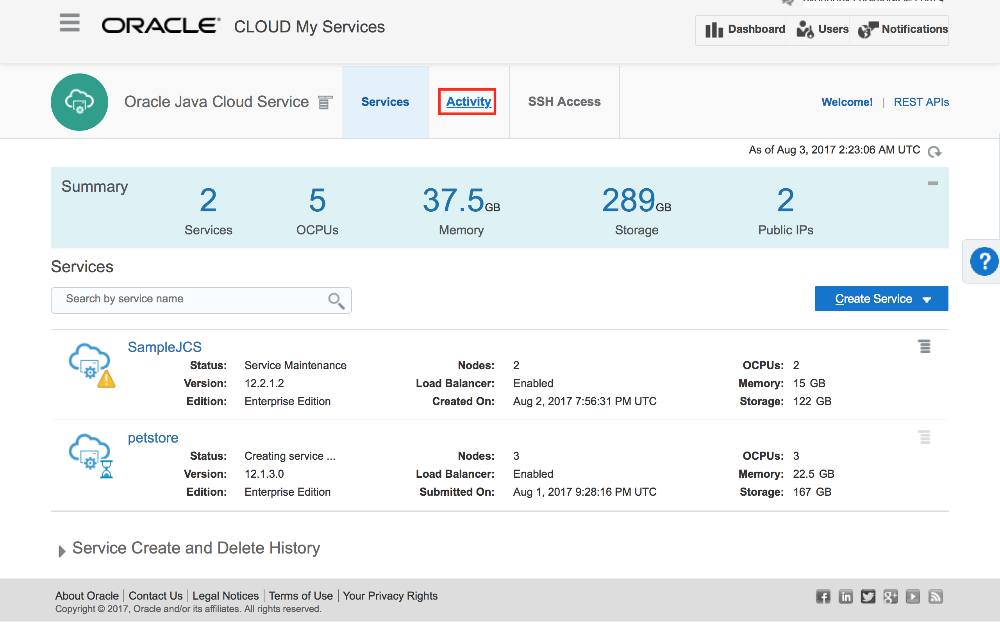
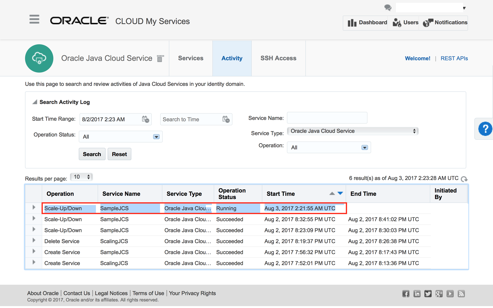

It takes about 3 - 8 minutes to complete the operation. You can click the arrow icon on the leftmost column to see the details and press the refresh button right above the activity table to check the operation status.
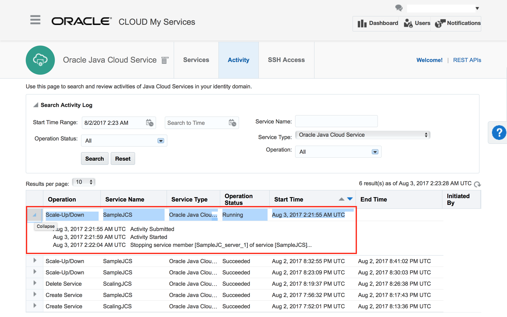
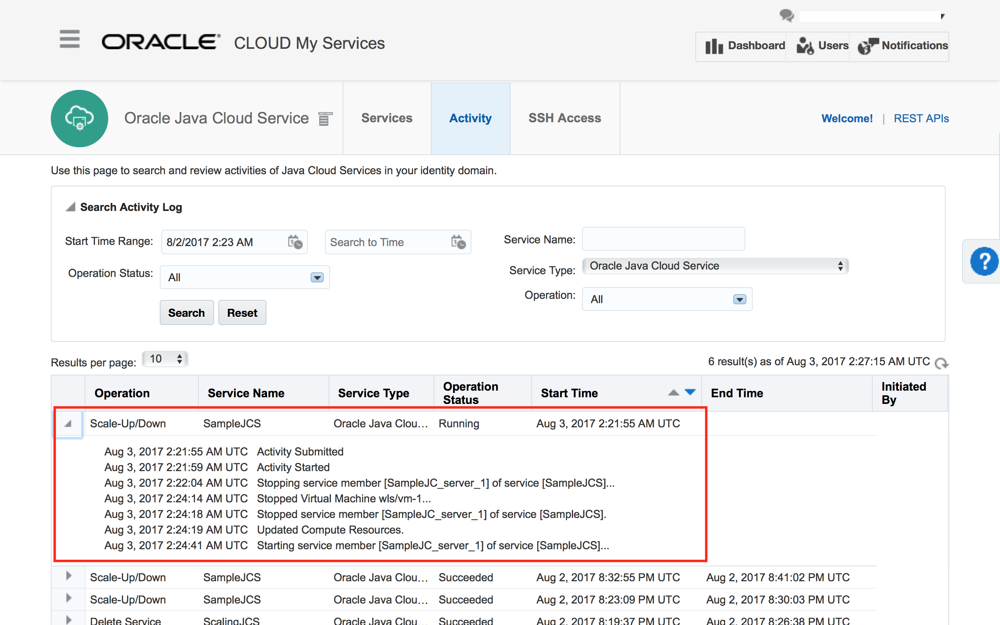
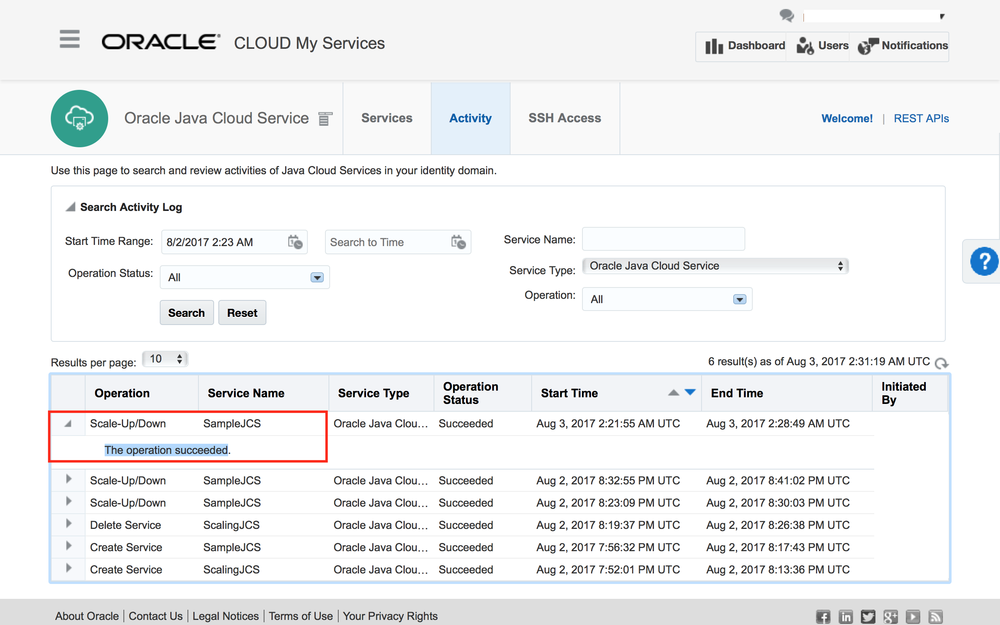

Click the **Services** tab at the top, and select the JCS service instance for which the scale-up operation was performed.  In the **Service Instance Details** page, you will notice that the number of OCPUs of the WLS node that you chose to scale up in the **WLS/Resources** section under **Service Overview** has changed accordingly. In this particular scenario, the selected node is now consuming 2 OCPUs.
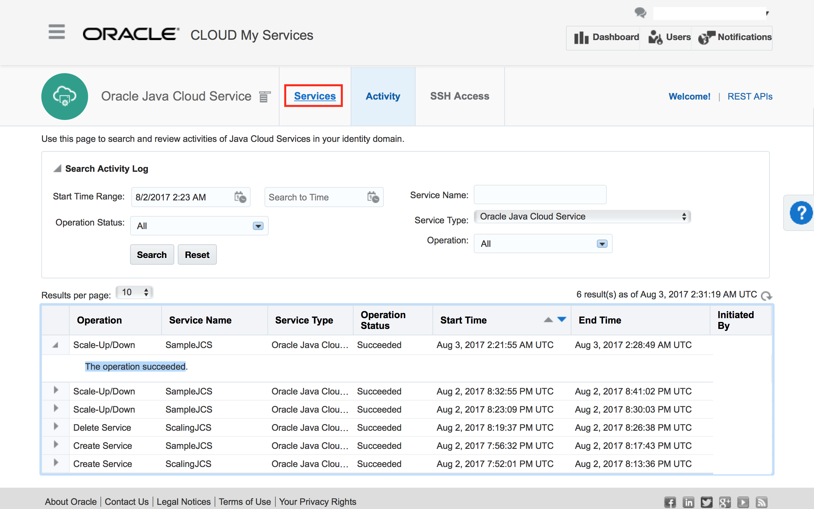

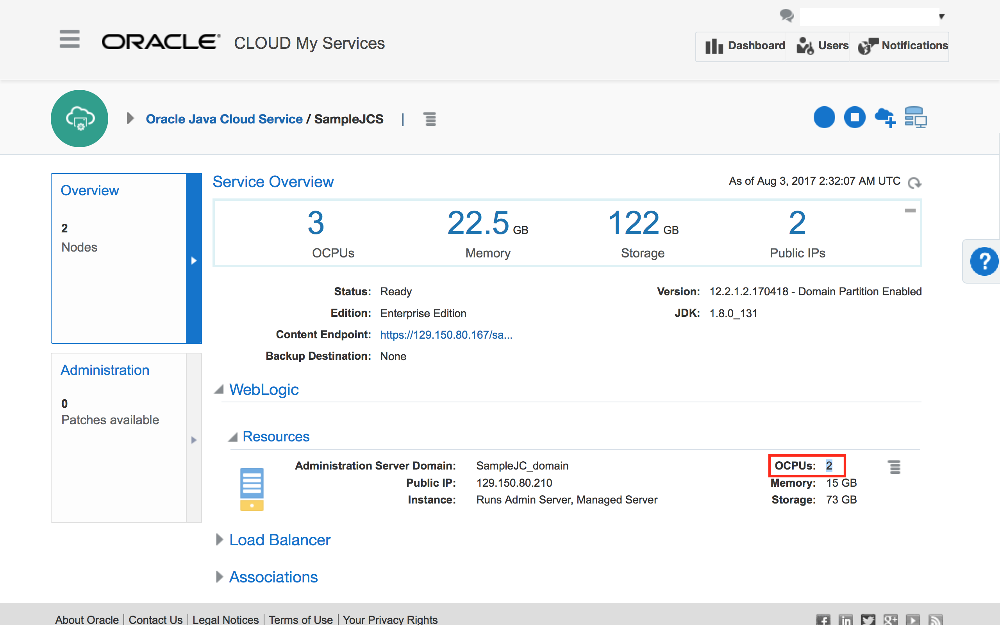

Just to check whether the application is still up and running after scale-up, click the **Content Endpoint** link as before. You should see the application on a new browser tab.
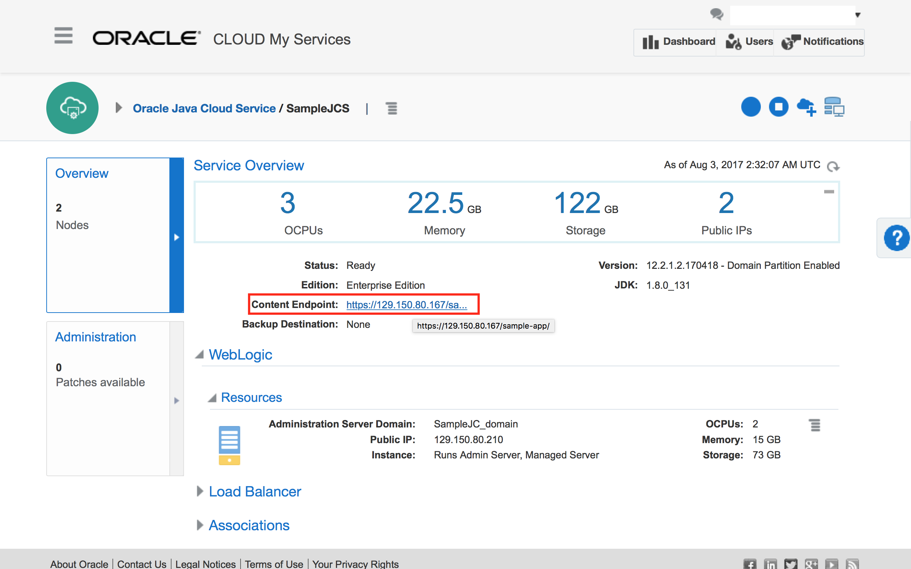

Come back to **JCS Service Instance Detail** page.
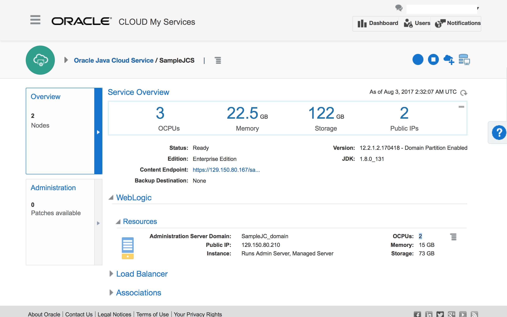
